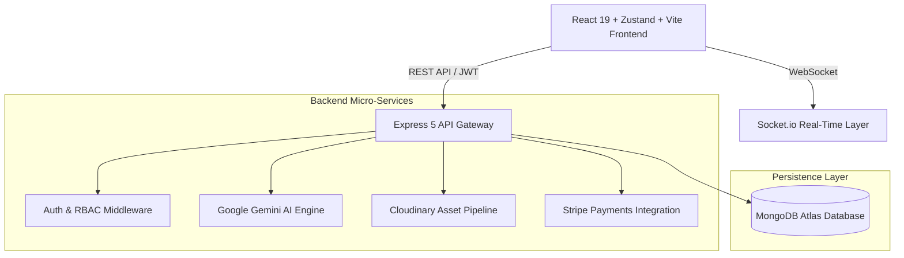

# 🌐 TuniVerse — Next-Gen Tunisian Career & Academic Super-Platform

<div align="center">

[](https://opensource.org/licenses/MIT)
[](https://nodejs.org)
[](https://reactjs.org)
[](https://mongodb.com)
[](https://vitejs.dev)
[](https://mosma.vercel.app)

<p align="center">
  <strong>A full-stack, AI-powered digital super-platform connecting Tunisian high-school graduates, university students, and job-seeking professionals with verified academic institutions and top recruiters.</strong>
</p>

[Explore Live Platform](https://tuniverse.up.railway.app/) • [Admin Control Centre](https://tuniverse.up.railway.app/admin/) • [View Author Portfolio](https://mosma.vercel.app) • [Report Bug](https://github.com/7amouch2k01-oss/final-project/issues)

</div>

---

## 🌟 Executive Overview

**TuniVerse** is a unified, multi-portal web platform engineered to eliminate bureaucratic friction in Tunisia's academic orientation and employment markets. It unifies **three specialized centres** into one cohesive system:

1. 🎓 **Academic Hub (For Students)**: Digital application engine for university admissions (ESPRIT, INSAT, MSB, ENIT, etc.), internship matchmaking (PFE / Summer stages), Baccalaureate verification, score calculating algorithms, and an integrated **AI Academic Advisor** (Google Gemini).
2. 💼 **Career Centre (For Professionals & Recruiters)**: Fast-paced employment portal for remote, hybrid, and on-site careers in Tunisia, featuring verified recruiter rights, candidate inquiries, portfolio showcases ("Hire Me"), and Stripe checkout.
3. 🛡️ **TuniVerse Control Centre**: Real-time management console for platform analytics, user moderation, recruiter KYC validations, institution onboarding, and system audit logs.

---

## 📐 System Architecture



---

## 🚀 Key Features

### 🎓 Academic & Student Hub
- **Direct University Applications**: Submit admissions applications with transcripts and automated CV attachments.
- **PFE & Internship Portal**: Browse stages from Tunisia's leading tech hubs (*InstaDeep, Vermeg, Orange Digital Center, Telnet, Satoripop*).
- **Student Part-Time Jobs**: Verified student-friendly part-time opportunities (12-20h/week) with transparent salaries in TND and flexible scheduling.
- **⭐ Pro Student Hub**:
  - **AI Orientation Advisor**: Live conversational agent trained on the Tunisian orientation score formula (*Score de Réorientation*).
  - **Task & Sprint Board**: Kanban organizer for PFE deadlines and project deliverables.
- **Academic Verification Engine**: Official Tunisian Baccalaureate diploma validation with in-app previewer and 24-hour administrative review center.

### 💼 Career Centre (Citizens & Recruiters)
- **Verified Recruiter Workflow**: Citizens and hiring managers can request recruiter rights to post jobs and review candidate CVs.
- **Direct Application Hub**: One-click application pipeline with status tracker (*Pending → Under Review → Accepted / Rejected*).
- **"Hire Me" Freelance Showcase**: Publish service availability cards with direct messaging and inquiries.

### 🛡️ TuniVerse Control Centre (Administration)
- **KYC & Recruiter Rights Approval**: Review business credentials and approve or reject recruiter rights.
- **Baccalaureate Verification Queue**: Inspect uploaded diplomas in high-resolution with zoom controls, verify official Ministry stamps, and confirm authentic academic credentials.
- **Jobs, Part-Time & Stage Directory**: Full CRUD oversight over all listings across Tunisia with tabbed categorization.
- **Real-Time Analytics**: Visual metric charts and system logs.

---

## 💻 Tech Stack & Engineering

| Layer | Technologies |
|---|---|
| **Frontend UI** | React 18, React Router v6, Zustand, Vite 8, Lucide & Custom SVG vectors |
| **Styling & Design** | CSS Variables, Custom Dark Glassmorphism + Soft Zinc Light Theme, Responsive Clamp Grids |
| **Backend Core** | Node.js (v18+), Express 5, Mongoose 9, Socket.io |
| **Performance & Speed** | Gzip/Brotli Network Compression, MongoDB Socket Connection Pooling (50 max / 10 min), 1-Year Immutable Static Asset Caching |
| **Security & Auth** | JWT (HttpOnly cookies + Bearer), BCrypt.js, Helmet, HSTS Enforcement, Express Rate Limit (Dual-layer), Postman Test Suite |
| **AI & Cloud** | Google Gemini Generative AI SDK, Cloudinary Multi-part storage, Stripe API |
| **DevOps & Deploy** | Railway Cloud CI/CD, Git, GitHub Actions, MongoDB Atlas |

---

## 🛠️ Getting Started

### 1. Prerequisites
- **Node.js**: `>= 18.0.0`
- **npm**: `>= 9.0.0`
- **MongoDB**: Local URI or MongoDB Atlas connection string

### 2. Installation & Setup

```bash
# Clone repository
git clone https://github.com/7amouch2k01-oss/final-project.git
cd final-project

# Install root, backend, frontend, and admin dependencies
cd backend && npm install
cd ../frontend && npm install
cd ../admin && npm install
cd ..
```

### 3. Environment Configuration

Create a `.env` file in `backend/`:

```env
PORT=5000
NODE_ENV=development
MONGO_URI=mongodb+srv://<username>:<password>@cluster0.mongodb.net/tuniverse?retryWrites=true&w=majority
JWT_SECRET=your_super_secret_jwt_key_here
JWT_EXPIRES_IN=7d
CLIENT_URL=http://localhost:5173
ADMIN_URL=http://localhost:5174

# Cloudinary
CLOUDINARY_CLOUD_NAME=your_cloud_name
CLOUDINARY_API_KEY=your_api_key
CLOUDINARY_API_SECRET=your_api_secret

# AI Engine
GEMINI_API_KEY=your_gemini_api_key

# Stripe
STRIPE_SECRET_KEY=sk_test_...
```

### 4. Database Seeding

```bash
cd backend
node seed.js
```

### 5. Running the Application

Launch each workspace in separate terminal windows:

```bash
# 1. Start Backend API (Port 5000)
cd backend && npm run dev

# 2. Start Frontend Client (Port 5173)
cd frontend && npm run dev

# 3. Start Admin Dashboard (Port 5174)
cd admin && npm run dev
```

---

## 👨‍💻 Author & Portfolio

<div align="center">

Developed with ❤️ by **Mohamed Amine Rzeigui**

🌐 **Personal Portfolio**: [https://mosma.vercel.app](https://mosma.vercel.app)  
🐙 **GitHub Profile**: [@7amouch2k01-oss](https://github.com/7amouch2k01-oss)  
🔗 **Direct Portfolio Link**: [mosma.vercel.app](https://mosma.vercel.app)

---

*Crafted with modern software engineering standards, clean architecture, and passion for digital transformation in Tunisia.* 🇹🇳

</div>
