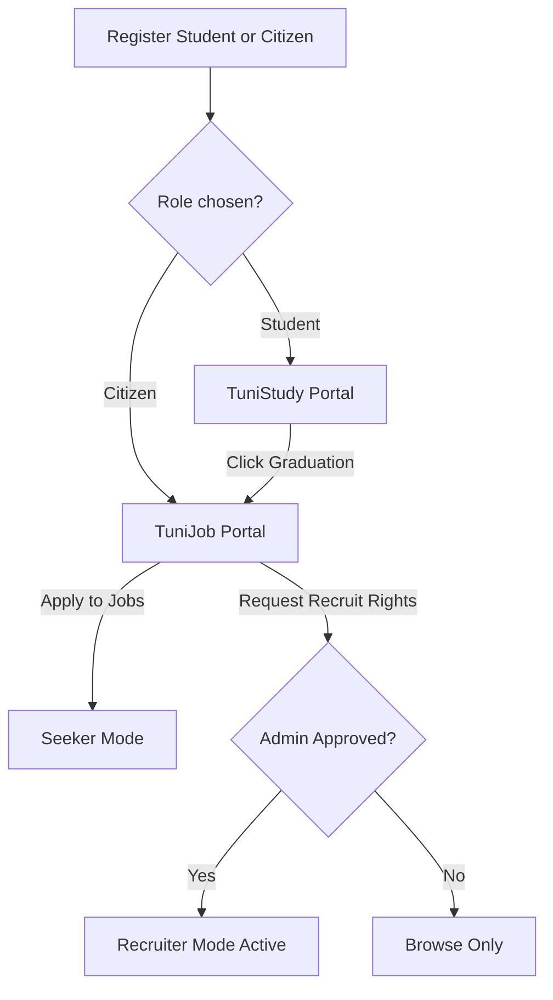

# 🎬 TuniStudy / TuniJob — Technical Walkthrough

A comprehensive review of the final project implementation. The codebase builds a single-codebase, dual-branded academic and career hub optimized for Tunisian students and job seekers.

---

## 🎨 Dual Brand Theme Context & Dynamic Gradients
The frontend detects the user's role on authentication and updates the HTML root theme attribute:
```javascript
const updateThemeByRole = (role) => {
  if (role === 'admin') {
    setTheme('admin');       // Brand: TuniAdmin (Crimson accent #ef4444)
  } else if (role === 'citizen') {
    setTheme('citizen');     // Brand: TuniJob (Emerald accent #10b981)
  } else {
    setTheme('student');     // Brand: TuniStudy (Indigo accent #6c63ff)
  }
};
```
This updates the CSS custom properties instantly. It dynamically adjusts the top-left ambient color glow of the radial gradient mesh directly on the page body:
```css
body {
  background-image: 
    radial-gradient(at 0% 0%, var(--accent-soft) 0px, transparent 50%),
    radial-gradient(at 100% 100%, rgba(0, 210, 255, 0.04) 0px, transparent 50%);
}
```

---

## 🌟 Simple & Clear Split-Hero Routing
The landing page implements a side-by-side split hero dividing the platform into **TuniStudy** (for academic routes) and **TuniJob** (for career routes). The CTAs pre-select the appropriate role using URL search parameters, creating a seamless signup flow.

---

## 🔄 User Lifecycle Flow



---

## 💾 Core Backend Controllers

All controllers follow the **fat service / thin controller** pattern:
1. **[`authController.js`](file:///c:/Users/mosma/OneDrive/Desktop/GoMyCode/my%20personal%20projects/Final%20Project/backend/controllers/authController.js)**: Handles registration, login, token refresh, and password recovery.
2. **[`listingsController.js`](file:///c:/Users/mosma/OneDrive/Desktop/GoMyCode/my%20personal%20projects/Final%20Project/backend/controllers/listingsController.js)**: Manages CRUD logic for Universities, Stages, Jobs, and Applications.
3. **[`userController.js`](file:///c:/Users/mosma/OneDrive/Desktop/GoMyCode/my%20personal%20projects/Final%20Project/backend/controllers/userController.js)**: Handles profiles, Cloudinary avatar & CV updates, and graduation requests.
4. **[`adminController.js`](file:///c:/Users/mosma/OneDrive/Desktop/GoMyCode/my%20personal%20projects/Final%20Project/backend/controllers/adminController.js)**: Manages recruiter approvals, platform statistics, bans, and broadcasts.

---

## 🔒 Verification & Security Hardening
- **JWT Protection**: Tokens verified securely via HTTP-only cookie refresh flows.
- **Route Guards**: `protect` combined with role restrict checks (`restrictTo('admin')`) and a custom `requireRecruitRights` database verification guard.
- **HTTP Hardening**: Helmet security headers, CORS origin whitelisting, and strict Express route rate limiters.
